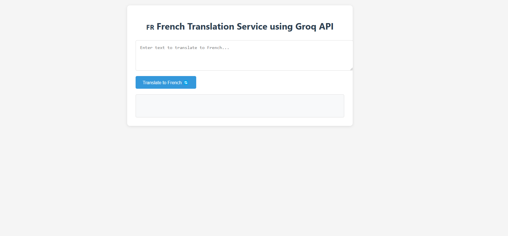
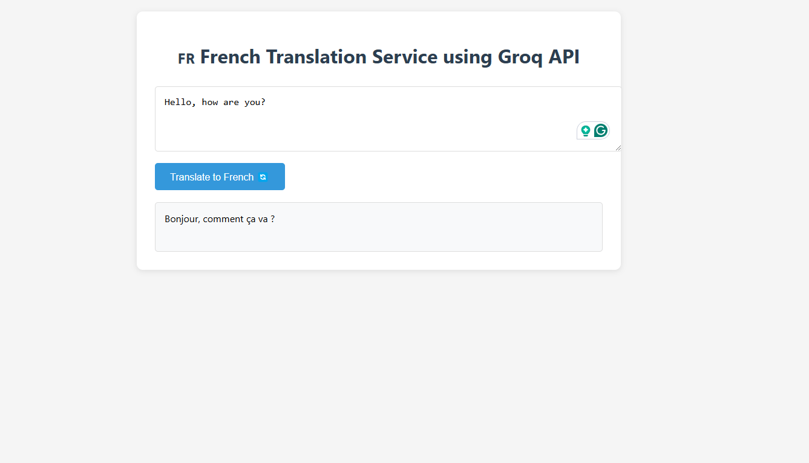

# 🇫🇷 French Translation API

A modern Flask application that translates text to French using the Groq API. Features a clean web interface and REST API endpoints.

## ✨ Features

- Clean, modern web interface
- Real-time translation to French
- RESTful API endpoint
- Error handling and loading states
- Mobile-responsive design

## 🚀 Setup

1. Install dependencies:
   ```bash
   pip install -r requirements.txt
   ```

2. Run the application:
   ```bash
   python app.py
   ```

## 📖 Usage

### Web Interface
1. Open `http://localhost:5000` in your browser
2. Enter your text in the input field
3. Click "Translate to French"
4. See your translation appear below

### API Endpoints

#### Translation Endpoint
- **URL**: `/translate`
- **Method**: `POST`
- **Content-Type**: `application/json`

##### Request Format:
```json
{
    "text": "Hello, how are you?"
}
```

##### Response Format:
```json
{
    "original": "Hello, how are you?",
    "french": "Bonjour, comment allez-vous?"
}
```

#### Example Usage

Using curl:
```bash
curl -X POST http://localhost:5000/translate \
-H "Content-Type: application/json" \
-d "{\"text\":\"Hello, how are you?\"}"
```

Using Python:
```python
import requests

response = requests.post('http://localhost:5000/translate', 
    json={'text': 'Hello, how are you?'})
print(response.json())
```

## 🛠 Error Handling

The API returns appropriate HTTP status codes:
- `200`: Successful translation
- `400`: Bad request (missing or empty text)
- `500`: Server error (API issues)

## 🔒 Security Note
Remember to keep your API keys secure and never commit them to version control.

## output



